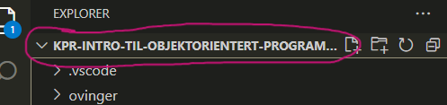
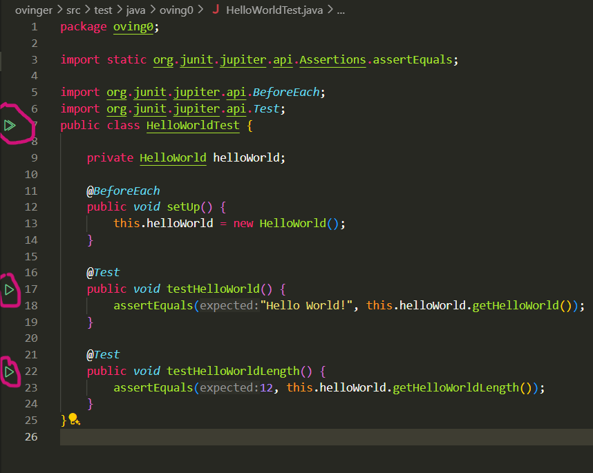

# Velkommen til første introduksjon til Objektorientert Programmering (OOP)

### Forord

For mange er det å programmere objektorientert selve grunnen til at de blir glade i programmering. Objektorientert programmering egner seg svært godt til større systemer, fordi det gir en naturlig oppdeling i programenheter som kan skrives delvis uavhengig av hverandre. Objektorientert programmering er også egnet for å utvikle gjenbrukbare programbiblioteker, slik at en sparer tid og ressurser. Av den grunn, er objektorientert programmering mye brukt i programvareindustrien, og er noe som alle som ønsker å bli utviklere bør være innom.

Etter denne introduksjonen kommer dere til få et svært utvidet syn på hva programmering er, men det kommer til å koste.. Det kommer til å kreve **innsats**.

For det skal også sies at objektorientert tankegang kan oppleves som litt vanskelig og kompleks, og at det derfor er greit å ha vært borti såkalt prosedyreorientert programmering (POP) før en lærer den objektorienterte varianten. Dette har vi jobbet med i Python, men nå skal vi ta steget inn i den objektorienterte verdenen!

..og for dette skal vi bruke verdens nydeligste programmeringsspråk! ❤️ **JAVA** ❤️

## Del 1: Installere JDK og VS Code

For å kunne programmere i Java må du først installere Java Development Kit (JDK). Som vanlig kommer vi til å bruke VS Code som IDE.

### Windows

Det er flere som har laget sin egen versjon av java, og det spiller ikke så stor roller hvilken dere installerer, så lenge det er siste Java LTS versjon (Long Term Support).

Her kan en godt bruke Adoptium sin Temurin JDK

1. Gå til https://adoptium.net/
2. Last ned installasjonsfilen som passer til ditt operativsystem.
3. Kjør installasjonsfilen.
4. Pass på at installasjonen setter JAVA_HOME-variablen
5. Velg Set JAVA_HOME til å installere på local hard drive
   
6. Fullfør installasjonen ved å trykke videre
7. Start PCen på nytt for å sørge at JAVA_HOME blir oppdatert
8. Sjekk om JDK har blitt installert riktig ved å kjøre:
   - Windows:
     - CMD:
       - `echo %JAVA_HOME`
     - Powershell:
       - `echo $Env:JAVA_HOME`
   - MAC / OSX / Linux
     - `echo $JAVA_HOME`
9. Sjekk også at Java er installert ved å kjøre `java -version` i samme terminal

### Mac / OSX

Vi anbefaler at dere bruker Homebrew for installasjon av utviklingsverktøy på macOS. Dette er en "package manager" som lar deg laste ned programmer og lignende ved hjelp av enkle terminal-kommandoer, og sparer deg generelt for veldig mye jobb.

- Du kan åpne terminalen ved å søke etter "terminal".

- Du kan installere Java med denne kommandoen: `brew tap homebrew/cask-versions` og
  `brew install --cask temurin21`

- Restart maskinen og sjekk at JAVA_HOME ble satt riktig med: `echo $JAVA_HOME` og `java -version`

- Hvis begge kommandoene finner Java, har du installert JDK riktig.

### Linux

- Bruker du Linux klarer du nok å installere JDK uten detaljerte instruksjoner. Husk likevel å sjekke at JAVA_HOME blir riktig satt med kommandoen `echo $JAVA_HOME`.

Lykke til! :)

## Del 2: Installere nødvendige VS Code extensions (utvidelser)

Gå til puslespill fanen (extensions i VS Code) og installer alt som ligger under "recommended" (dukker det ikke opp kan du søke etter @recommended)

Du kan også gjøre det manuelt ved å søke opp disse utvidelsene:

- Extension Pack for Java

## Del 3: Hello world

For å teste at du har installert JDK og VS Code riktig, og satt opp prosjektet riktig, skal du nå kjøre et enkelt program som skriver ut "Hello world!" til konsollen.

- Åpne øvingsprosjektet i VS Code. Sørg for at mappen `KPR-INTRO-TIL-OBJEKTORIENTERT-PROGRAMMERING` er den ytteste mappen i VS Code: 

- Åpne filen [ovinger/src/main/java/oving0/HelloWorld.java](./ovinger/src/main/java/oving0/HelloWorld.java).
  Denne filen inneholder et enkelt program som skriver ut "Hello world!" til konsollen. Klikk på "Run" knappen i VS Code for å kjøre programmet (Oppe til høyre). Du skal nå se "Hello world!" i konsollen.

## Del 5: Kjøre enhetstester

Enhetstester er en måte å sjekke at koden din fungerer som den skal. I øvingene er det opprettet enhetstester for hver oppgave. For å sjekke at prosjektet ditt er satt opp riktig, skal du kjøre enhetstester for Hello world-programmet du nettopp kjørte i del 3.

- Åpne filen [ovinger/src/test/java/oving0/HelloWorldTest.java](./ovinger/src/test/java/oving0/HelloWorldTest.java). Denne filen inneholder enhetstester for Hello world-programmet. For å kjøre alle testene klikker man på den øverste grønne dobbel-pilen i VS Code. Man kan også kjøre en og en test ved å klikke på den grønne enkelt-pilen ved siden av hver test:
  

- Etter å ha kjørt testene skal du se at alle testene er grønne, og at det står **2/2** i vinduet som åpner seg til venstre. Får du røde kryss, er det noe feil i koden. I øvingsopplegget kan du kjøre en test for hver oppgave for å sjekke om du har klart oppgaven på riktig måte.

## Del 6: Start øvingene

Du er nå klar til å starte på øvingsopplegget.

Vi anbefaler å starte på øving 0, som tar for seg forskjellene mellom Python og Java i grove trekk.

Føler du deg kjent med Java eller lignende språk, kan du hoppe rett på oving 1.

Lykke til!

- [Øving 0: Python vs Java](./ovinger/oppgavetekster/oving0/python_vs_java.md)

- [Øving 1: Objekter, klasser, tilstand og oppførsel](./ovinger/oppgavetekster/oving1/README.md)

# Ekstra: Feilsøking

### Build failed

En standardinnstilling for tilleggspakken Debugger for Java sjekker om hele prosjektet bygger feilfritt før man kjører koden. Dette er ikke alltid ønskelig i øvingsopplegget, siden de fleste oppgavene ikke avhenger av andre. Hvis man ikke endrer denne innstillingen får man denne meldingen hver gang man prøver å kjøre noe kode dersom det er en feil i prosjektet:

Så må man trykke Proceed for å kjøre koden, som vanligvis kjører helt fint (med mindre det faktisk er feil i den koden du vil kjøre).

For å skru av denne funksjonen, gjør følgende:

1. Åpne settings.json ved Ctrl + Shift + P og søk etter user settings JSON:
2. Legg til denne linjen i settings.json:
   `"java.debug.settings.forceBuildBeforeLaunch": false`

### Andre problemer

1. Åpne command palette (Ctrl + Shift + P) og søk etter _Java: Clean Java Language Server Workspace_.
2. Trykk deretter på _Reload and Delete_ (Det sletter ikke kode, bare konfigurasjons-filer)

### Finner ikke JAVA_HOME

Om du har flere Java versjoner kan det hende at VS Code er satt til feil versjon av JDK. Det kan du sjekke ved å gjøre følgende:

1. Åpne settings.json ved å søke i command palette (Ctrl + Shift + P)
2. Sjekk om du finner `java.jdt.ls.java.home`
3. Om du **ikke finner** den er alt greit, og du trenger ikke gjøre noe mer
4. Hvis du **finner** `java.jdt.ls.java.home`, må du passe på at den er satt til samme plassering der JDK ble installert (Feks: C:\\Program Files\\Eclipse Adoptium\\jdk-21.0.3.9-hotspot)
